# TP1 : Cloud Computing

# Exercice 2 :
Sur votre machine physique, lancer le logiciel Virtual Box (distribué gratuitement par Oracle
sous licence GPLv2). Cet outil émule un PC dans lequel vous lancerez des machines virtuelles
avec différents systèmes d’exploitation. La configuration de ces machines est schématisée
dans le tableau ci-dessous

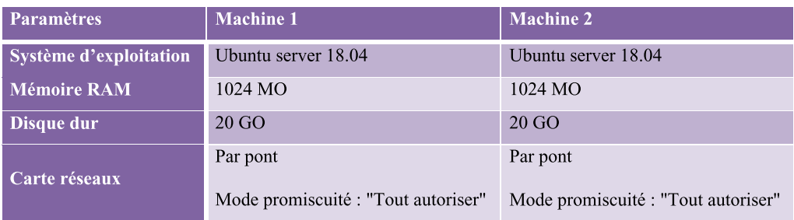

# pré requis :
* Linux / Windows OS  : `Ubuntu 22:04`
* Virtualbox 
* Virtual Machine : `ubuntu 18.04.6 live server amd64 (fichier .iso)`
* SSH client :  `Termius LTS v7.49.0`
## Installer l’hyperviseur « Oracle Virtual Box »
```
$ sudo apt install virtualbox
```
Lancer virtualbox :
```
$ virtualbox
```
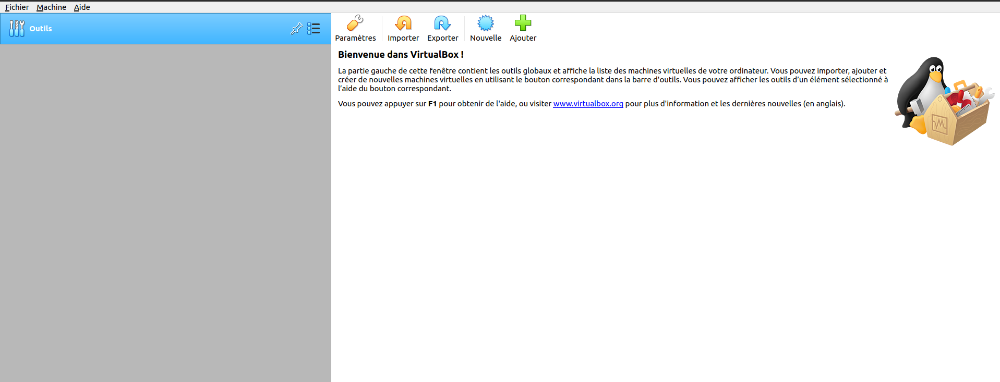

`VirtualBox` est une solution de virtualisation qui permet de faire
fonctionner un système d'exploitation via une machine virtuelle
(hyperviseur type 2).

systeme de fichier 
* win  :  fat32
* Linux : ext

 protocole pour faire la connexion sécurisée à distancce : 
* install OpenSSH server (protocole ssh)
## Créer deux machines virtuelles appelées VM 1 et VM 2.

### Creation de la 1ere machine virutelle VM1

`Clicker` sur nouvelle  ou Machine > Nouvelles
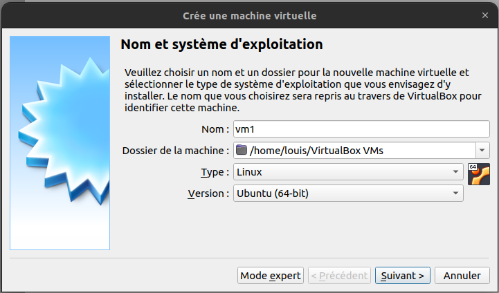
](./rsc/creer_une_machine_virtuelle.png)
pour créer une machine virtuelle il faut renseigner  : 
* `nom` de la machine 
* `path` de la machine
* `type` de machine
* et la `version` 

`Suivant` Taile de la machine = 1 Go soit 1024 MB
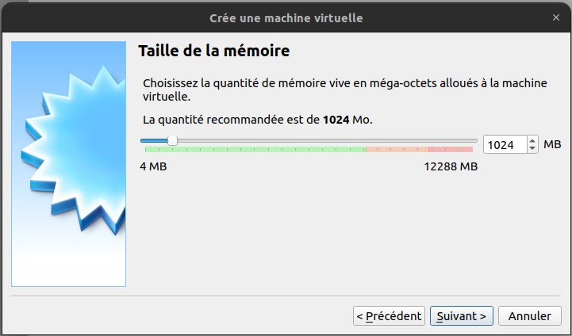

`Suivant` Disque de vitual Machine 
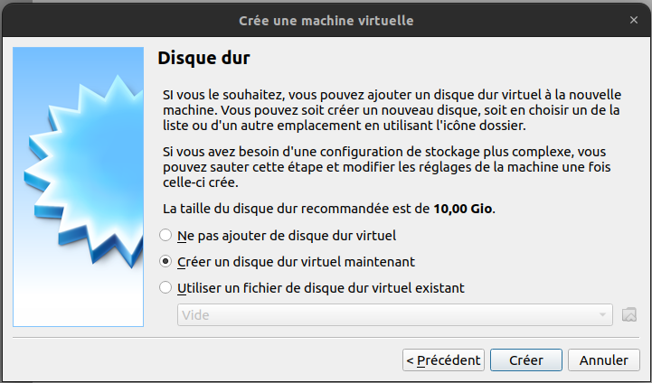

`Suivant` Disque Dur  = 20 Go
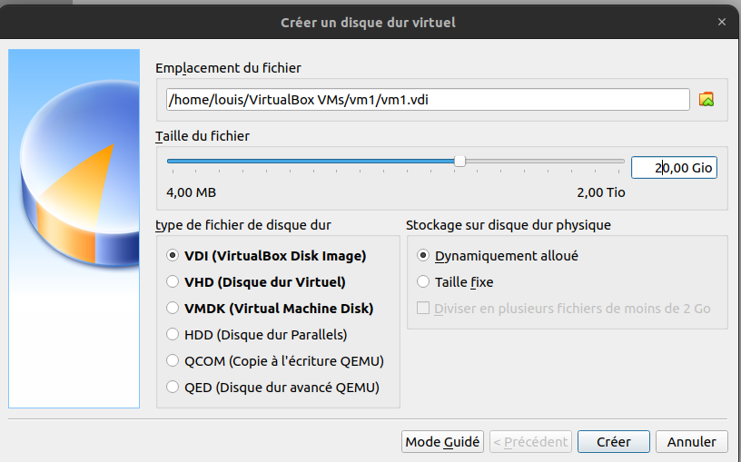

Ensuite créer la Machine vm1
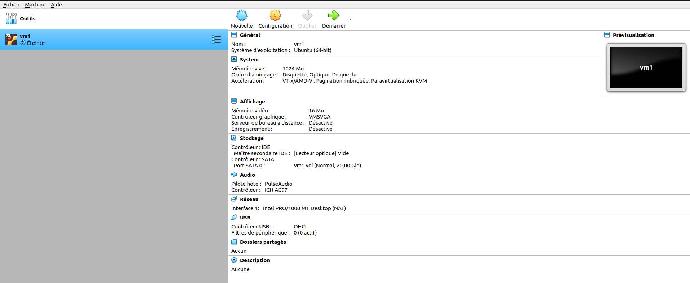

configuration > paramètre 


### Installer Ubuntu Server en tant que vm1
demarrer l'installation de ubuntu server vm1
et ajouter le fichier iso de ubuntu server
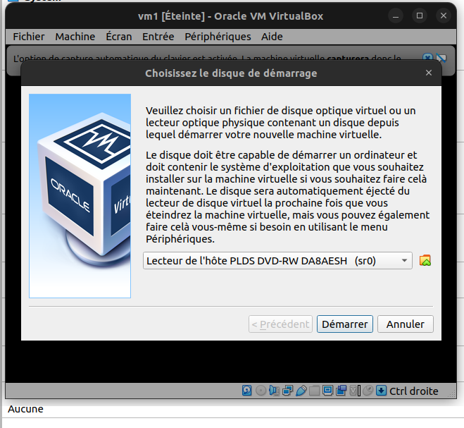

choisir le fichier iso


Lancer le demarrage de l'installation
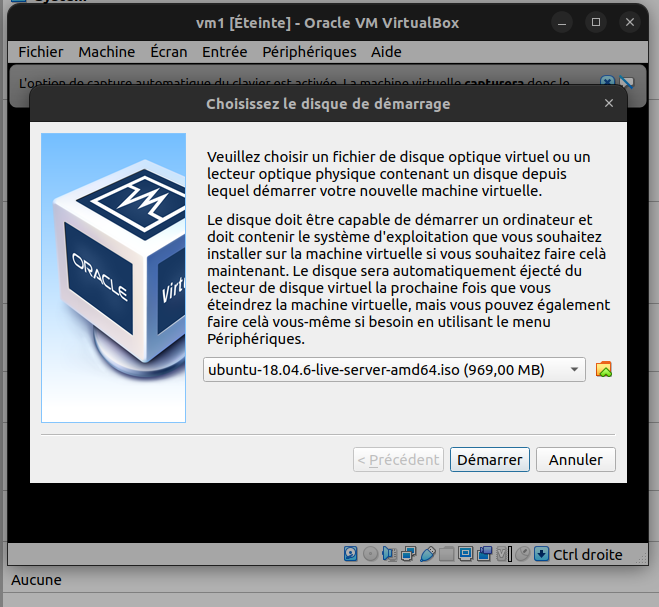

choisir la langue 
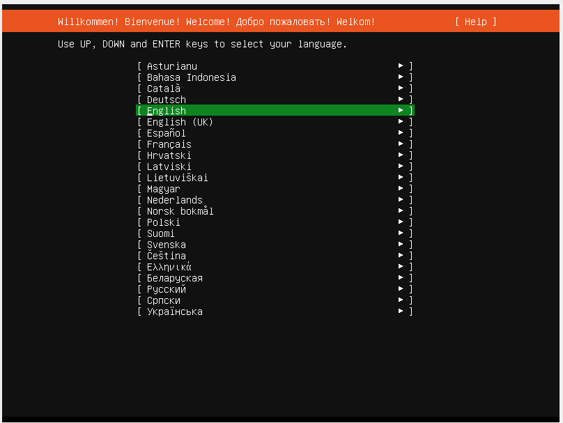

choisir la langue du clavier 
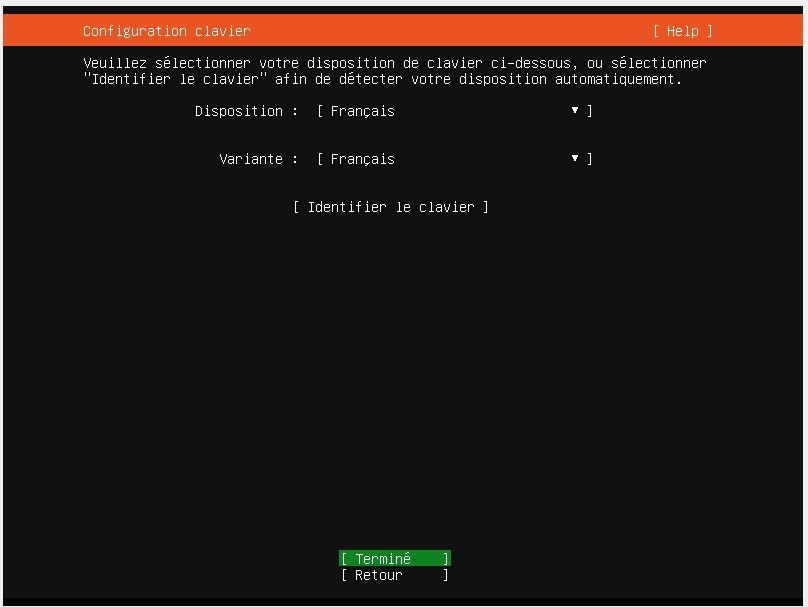

Connexion réseau


Configurer le proxy
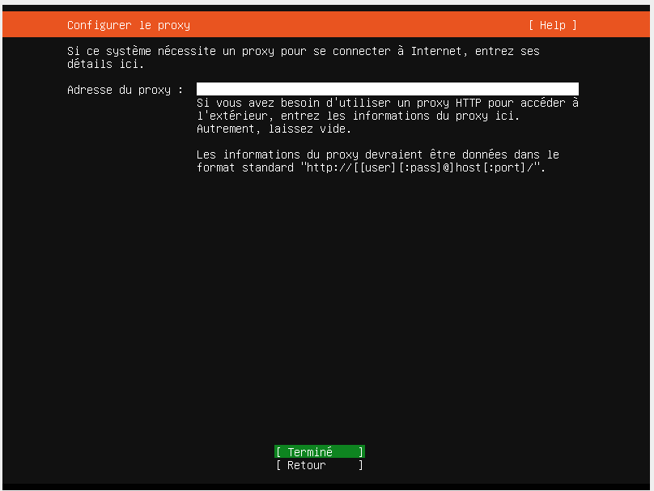

ubuntu archive mirror
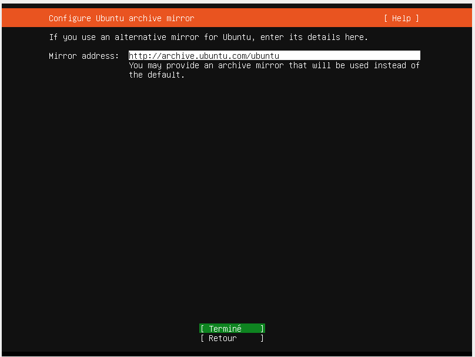

Guide Configureration storage


Configureration storage summary
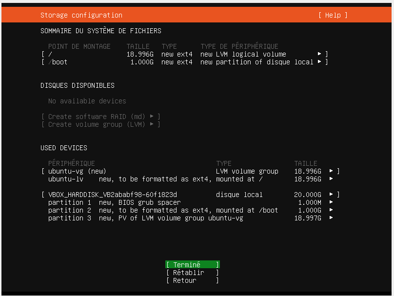
continuer
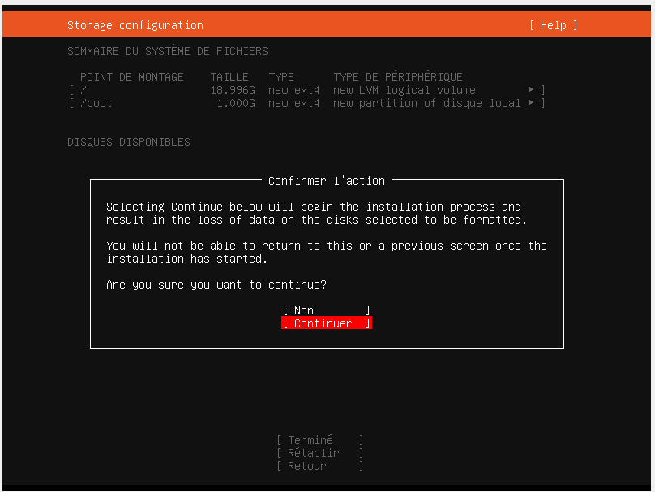

Le profile
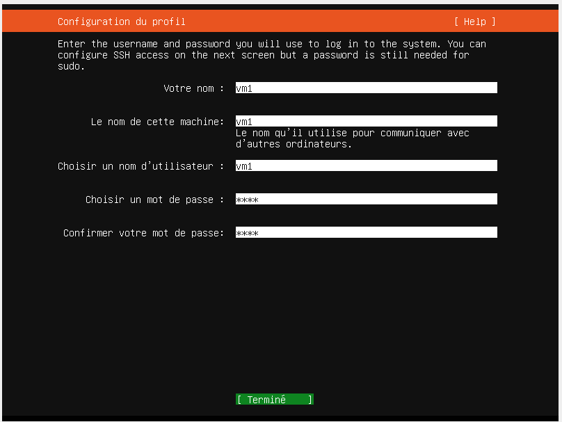

Installer le OpenSSH server
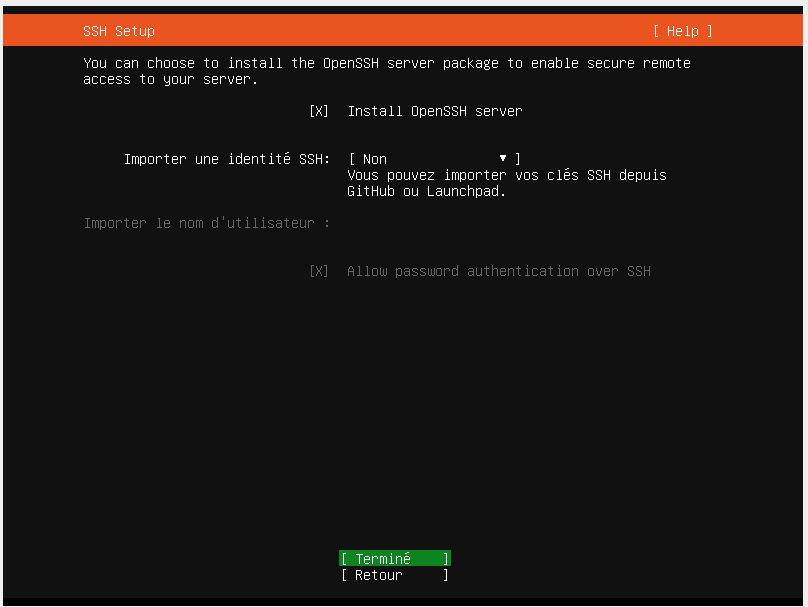
### Creation de la 2em machine virutelle VM2

Refaire les mêmes étapes 

Ensuite démarrer les deux machines en parallèle

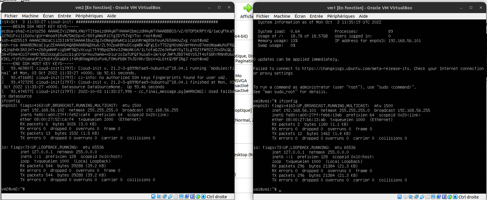

## Quelle est l’adresse IP / MAC de chaque machine virtuelle ?

Adressage IP / MAC des machine:
* windows command
```
ifconfig
```
* windows command
```
ipconfig 
```
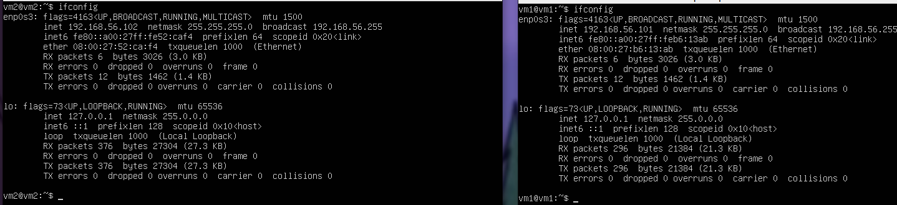
* ip vm1 : `192.168.56.101`
* ip vm2 : `192.168.56.102`
  
login: vm1\
passwordd : test

## Lancer un test de VM1 à VM2 (ping VM2 dans la fenêtre de VM1), et observer les messages interceptés.
```
vm2:~$ping 192.168.56.101
```
```
vm1:~$ping 192.168.56.102
```
`CTL+C` pour arrêter les commandes ping 


## Installer le serveur openssh-server et établir une connexion entre les deux machines.

```
$ sudo apt-get install openssh-server
```
vérifier si notre ubuntu à openssh-server
```
$ shh

usage: ssh [-46AaCfGgKkMNnqsTtVvXxYy] [-B bind_interface]
           [-b bind_address] [-c cipher_spec] [-D [bind_address:]port]
           [-E log_file] [-e escape_char] [-F configfile] [-I pkcs11]
           [-i identity_file] [-J [user@]host[:port]] [-L address]
           [-l login_name] [-m mac_spec] [-O ctl_cmd] [-o option] [-p port]
           [-Q query_option] [-R address] [-S ctl_path] [-W host:port]
           [-w local_tun[:remote_tun]] destination [command [argument ...]]
```

se connecter à un host : 
```
hostname@ubuntu-laptop:~$ ssh hostname@ip_adresse
```
Outils pour faciliter l'utilisation des MV exemple : 
* MobaXtern (win)
* Termius (Linux)
  


## Se connecter à l'une des machines virtuelles distantes à travers le terminal ou l’utilitaire Terminus

### installer Termius
`Termius` est plus qu'un simple client SSH - c'est une solution complète de ligne de commande qui redéfinit l'accès à distance pour les sysadmins et les ingénieurs réseau.

Consulter les [Cas d'utilisations de Termius](https://support.termius.com/hc/en-us/articles/4401863615641-Hosts)

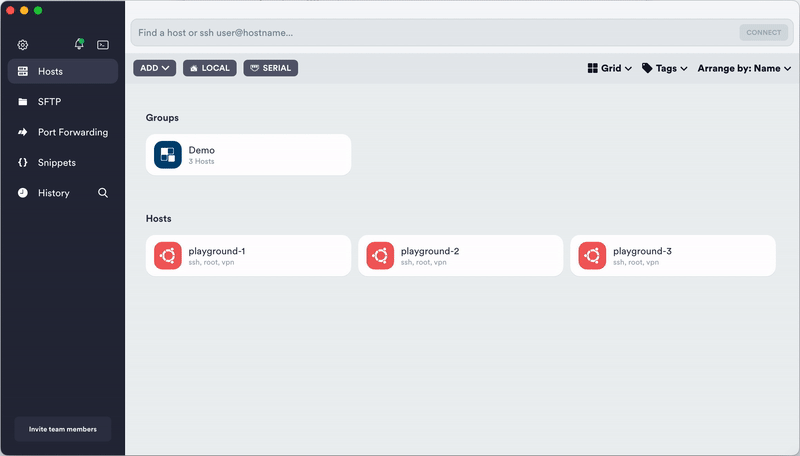
```
$ Sudo snap install termius-app
```

Démarrer Termius sur Terminal : 
```
$ termius-app
```
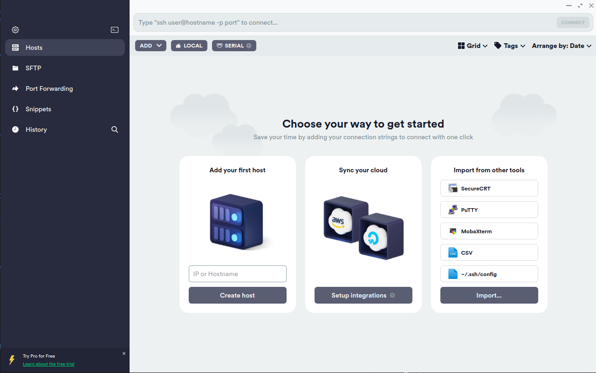

Nouvelle host : 
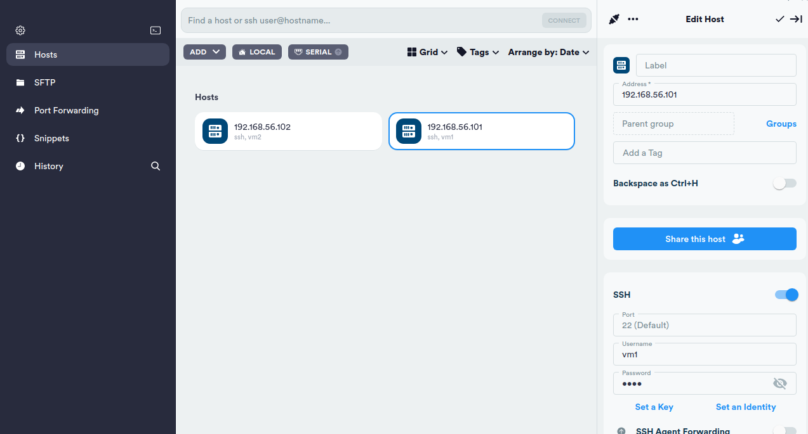

Termius : 
config ssh de la Machine vm1
  - Host : @ip Machine 1 \
  - SHH : 22\
    vm1  :  identities \
    password :  test \

port :

ssh : 22
HTTP : 80
HTTPS : 443
FTP : 20 / 21
#### Connexion Homme - Machine

connexion de vm2 dans vm1 à travers client ssh

```
vm1@vm1:~$ ssh vm2@192.168.56.102
```

```
$ ssh utilisateurDistante@adressIP
```
Interrompre la communication avec machine distante
```
$ exit
```


## Effectuer les modifications nécessaires pour se connecter à la machine distante sans aucune  demande de mot de passe. 

#### Connexion Machine - Machine

Gener les clé publique : privée avec la methode de cryptage rsa
```
ssh-keygen -t rsa
```

copier la clé public vers Virtuelle distante
```
ssh-copy-id utilisateur_distant@adresse_IP_distante
```
connexion à Machine distante 
```
$ ssh utilisateurDistante@adressIP
```


 ## Cloner, exporter et importer une VM. 


Cloner : Clic droit sur la VM 🡪 clone 🡪 clone lié (besoin de l’original pour  fonctionner) ou clone intégral (prend plus de place) 


 Exporter : Fichier -> Exporter un appareil virtuel 


 c. Importer : Fichier -> Importer un appareil virtuel -> choisir un fichier existant. 9. 


 Utiliser les instantanés (snapshots) : Créer et restaurer. Un snapshot sert à sauvegarder  l’état entier de la machine à un moment donné. On peut créer plusieurs snapshots les unes à la  suite des autres. Une fois la VM est lancée, onglet Machine 🡪 Tools 🡪 Take Snapshot (on  rentre le nom et la description).


 configurer le nom de domaine de l'adresse d'un site web 

```
sudo gedit /etc/hosts
```

[gedit]
# Ajouter un nom de domaine 
```
172.16.1.77 polytech.com.tn
```